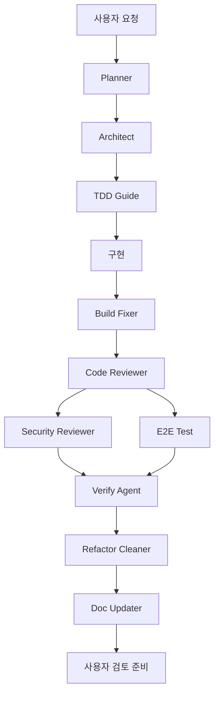

# 해내요 에이전트 셋업

이 문서는 해내요 개발에 사용할 에이전트 역할, 소통 방식, 검증 게이트를 정의한다.

## 전제

- 현재 저장소에는 특정 에이전트 런타임 설정 형식이 없다.
- 이 셋업은 Codex, Claude subagent, LangGraph 같은 실행 도구로 옮길 수 있는 역할 계약이다.
- 모든 에이전트는 루트 `AGENTS.md`, `README.md`, `docs/architecture.md`, `docs/product-technical-decisions.md`, ADR을 먼저 따른다.
- 작업은 작은 단위로 나누고, 각 에이전트는 자기 산출물을 검증 가능한 형태로 남긴다.
- 해내요의 문서와 에이전트 산출물은 한글로 작성한다. 명령어, 코드 식별자, 파일 경로, 라이브러리명은 원문을 유지한다.

## 에이전트

| 단계 | 에이전트 | 목적 | 역할 프롬프트 |
| --- | --- | --- | --- |
| 기획 | Planner | 구현 계획서 자동 작성 | [planner.md](./roles/planner.md) |
| 기획 | Architect | 아키텍처 설계 | [architect.md](./roles/architect.md) |
| 개발 | TDD Guide | 테스트 주도 개발 | [tdd-guide.md](./roles/tdd-guide.md) |
| 검증 | Code Reviewer | 코드 리뷰 + 보안 분류 | [code-reviewer.md](./roles/code-reviewer.md) |
| 검증 | E2E Test | 엔드투엔드 테스트 | [e2e-test.md](./roles/e2e-test.md) |
| 검증 | Build Fixer | 빌드 오류 자동 수정 | [build-fixer.md](./roles/build-fixer.md) |
| 검증 | Security Reviewer | 보안 전문 심화 검증 | [security-reviewer.md](./roles/security-reviewer.md) |
| 검증 | Verify Agent | 독립 컨텍스트 검증 | [verify-agent.md](./roles/verify-agent.md) |
| 검증 | Refactor Cleaner | 코드 정리 | [refactor-cleaner.md](./roles/refactor-cleaner.md) |
| 검증 | Doc Updater | 문서 자동 갱신 | [doc-updater.md](./roles/doc-updater.md) |

## Codex 명령

해내요 전용 Codex plugin은 `plugins/haenaeyo`에 있고, marketplace manifest는 `.agents/plugins/marketplace.json`에 있다.

설치된 명령:

- `/haenaeyo:workflow`
- `/haenaeyo:planner`
- `/haenaeyo:architect`
- `/haenaeyo:tdd-guide`
- `/haenaeyo:code-reviewer`
- `/haenaeyo:e2e-test`
- `/haenaeyo:build-fixer`
- `/haenaeyo:security-reviewer`
- `/haenaeyo:verify-agent`
- `/haenaeyo:refactor-cleaner`
- `/haenaeyo:doc-updater`

로컬 Codex에 다시 등록해야 하면:

```bash
codex plugin marketplace add /Users/jujaewan/1_Projects/haenaeyo
codex plugin add haenaeyo@haenaeyo-local
```

## Claude Code 명령

해내요 전용 Claude Code 슬래시 명령은 `.claude/commands/`에 있다.

설치된 명령 (Codex 명령과 동일):

- `/haenaeyo:workflow`
- `/haenaeyo:planner`
- `/haenaeyo:architect`
- `/haenaeyo:tdd-guide`
- `/haenaeyo:code-reviewer`
- `/haenaeyo:e2e-test`
- `/haenaeyo:build-fixer`
- `/haenaeyo:security-reviewer`
- `/haenaeyo:verify-agent`
- `/haenaeyo:refactor-cleaner`
- `/haenaeyo:doc-updater`

별도 설치 없이 프로젝트 루트에서 Claude Code를 실행하면 자동으로 인식한다.

## 소통 모델

에이전트는 직접 채팅한다고 가정하지 않는다. 대신 다음 산출물을 통해 비동기 소통한다.

1. Planner가 `docs/work-plans/<task-slug>.md` 초안을 만든다.
2. Architect가 계획서의 architecture section을 승인하거나 수정 요청을 남긴다.
3. TDD Guide가 실패하는 테스트 또는 테스트 목록을 먼저 제안한다.
4. 구현 담당자가 변경한다.
5. Build Fixer가 실패한 빌드/테스트 로그를 기준으로 최소 수정한다.
6. Code Reviewer, Security Reviewer, E2E Test, Verify Agent가 독립 검증한다.
7. Refactor Cleaner가 요청 범위 안에서만 정리한다.
8. Doc Updater가 실제 변경과 문서 차이를 맞춘다.

## 인수인계 패킷

모든 에이전트는 다음 형식으로 다음 에이전트에게 넘긴다.

```text
작업:
맥락:
변경 파일:
실행한 명령:
결과:
남은 위험:
다음 추천 에이전트:
```

재사용 템플릿:

- [작업 계획서 템플릿](./templates/work-plan.md)
- [리뷰 리포트 템플릿](./templates/review-report.md)

## 품질 게이트

- Backend: unit/integration test, Testcontainers, ArchUnit.
- Frontend: Vitest, React Testing Library, generated OpenAPI client 정합성.
- E2E: Playwright로 핵심 사용자 흐름만 검증한다.
- Architecture: feature-based hexagonal dependency direction을 깨지 않는다.
- Security: OpenAI key, OAuth, session cookie, logs, user data deletion, rate limit을 별도 확인한다.
- Docs: README, architecture docs, ADR, OpenAPI 관련 변경 여부를 확인한다.

## 기본 워크플로



## 워크플로 선택

- 새 기능: Planner -> Architect -> TDD Guide -> 구현 -> Build Fixer -> Code Reviewer -> 필요 시 Security Reviewer -> 사용자 흐름 변경 시 E2E Test -> Verify Agent -> Doc Updater.
- 버그 수정: Planner -> TDD Guide -> 구현 -> Build Fixer -> Code Reviewer -> Verify Agent -> 동작이 바뀌면 Doc Updater.
- 아키텍처 변경: Planner -> Architect -> TDD Guide -> 구현 -> Code Reviewer -> Verify Agent -> Doc Updater.
- 보안 민감 변경: Planner -> Architect -> TDD Guide -> 구현 -> Code Reviewer -> Security Reviewer -> Verify Agent -> Doc Updater.
- 문서만 변경: Planner -> Doc Updater -> Verify Agent.

## 심층 인터뷰 백로그

실행 도구를 실제로 연결하기 전에 답하면 좋은 질문은 [deep-interview.md](./deep-interview.md)에 모았다.
