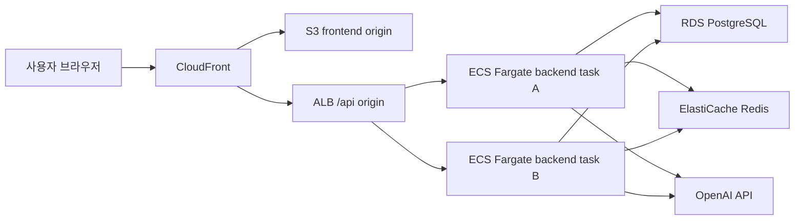
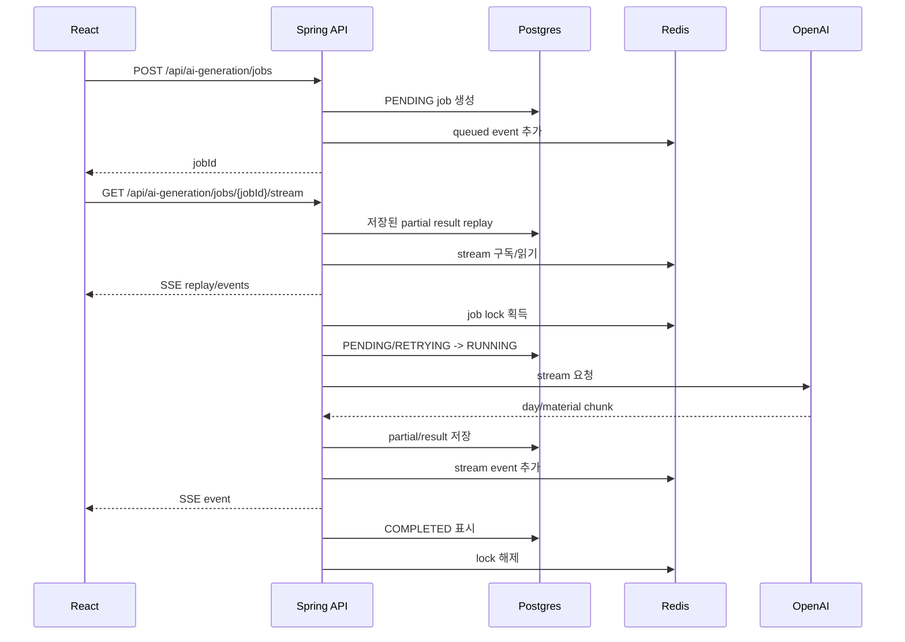

# 해내요 아키텍처

## 개요

해내요는 React SPA와 Kotlin Spring Boot API로 구성된 AI 기반 목표/계획 관리 서비스다.

1차 MVP는 Modular Monolith로 시작하되, AI generation을 가장 먼저 별도 서비스로 분리할 수 있도록 bounded context와 port boundary를 분명히 둔다.



## 백엔드 구조

Backend는 단일 Spring Boot 모듈에서 feature/package 중심 헥사고날 아키텍처를 따른다.

현재 패키지 구조:

```text
com.haenaeyo.backend
├── identity
│   ├── domain
│   ├── application
│   └── adapter
├── planning
│   ├── domain
│   ├── application
│   └── adapter
├── aigeneration
│   ├── domain
│   ├── application
│   └── adapter
└── common
```

각 feature 내부는 다음 방향을 따른다.

```text
feature
├── domain
│   ├── model
│   └── service
├── application
│   ├── command
│   ├── query
│   ├── port
│   │   ├── in
│   │   └── out
│   └── service
└── adapter
    ├── in
    │   └── web
    └── out
        ├── persistence
        ├── redis
        └── openai
```

의존성 방향:

```text
adapter -> application -> domain
```

규칙:

- Domain은 Spring/JPA/Web/OpenAI에 의존하지 않는다.
- JPA Entity는 persistence adapter에만 둔다.
- Controller는 application use case만 호출한다.
- Application은 adapter 구현체를 모른다.
- inbound/outbound port는 기본적으로 `application/port/in`, `application/port/out`에 둔다.
- 외부 API, DB, Redis 접근은 port를 통해 수행한다.

## Command와 Query

Command use case는 도메인 모델과 상태 전이를 중심으로 구현한다.

예:

- 계획 확정.
- Todo 완료/해제.
- 목표 중단/재개/완료.
- 목표 삭제/복구.
- 재계획 적용.
- 자료 적용/수정.

Query use case는 화면 전용 projection을 사용한다.

예:

- `GET /api/today`
- `GET /api/goals`
- `GET /api/calendar/month`
- `GET /api/calendar/days/{date}/todos`

QueryDSL을 기본으로 사용하고, Postgres 특화 집계는 native SQL을 허용한다.

## AI 생성 흐름

AI 생성은 Job 기반이다.



Postgres는 source of truth다:

- Job 상태.
- Partial result.
- Draft result.
- Final result.
- 실패 사유.
- Usage/token/cost 데이터.

Redis는 runtime coordination을 담당한다:

- Spring Session.
- Distributed lock.
- Redis Streams event delivery.

## AI Job 신뢰성

ECS task는 2개 이상으로 운영한다. 따라서 AI Job은 task-local memory에 의존하지 않는다.

중복 실행 방지:

1. Worker가 Redis lock을 획득한다.
2. Postgres에서 조건부 상태 전이를 수행한다.
3. 두 조건을 모두 통과한 worker만 OpenAI를 호출한다.

실패/재시도:

- 실패 시 정상 partial result는 유지한다.
- 같은 job을 `RETRYING`으로 재시작한다.
- retry는 최대 3회다.
- 이어서 생성은 마지막 정상 Day 다음부터 수행한다.

SSE 복구:

- 접속 직후 Postgres partial result를 replay한다.
- 이후 Redis Streams event id 기준으로 이어 받는다.
- `Last-Event-ID`를 사용해 누락 이벤트를 복구한다.

## 데이터 모델 주제

주요 ID는 UUID다. UUID는 애플리케이션에서 생성한다.

핵심 데이터:

- users / oauth accounts / sessions.
- goals.
- plan days.
- todos.
- todo feedback.
- day materials.
- plan revisions.
- AI generation jobs.
- AI usage records.

목표 삭제는 soft delete다.

회원 탈퇴는 관련 사용자 데이터를 hard delete한다.

재계획 적용 전에는 현재 계획 전체를 revision snapshot으로 보관한다. MVP에서 UI 노출은 하지 않는다.

## 배포

AWS 구성:

- Region: `ap-northeast-2`.
- Frontend: S3 + CloudFront.
- Backend: ECS Fargate desired count 2+.
- API routing: CloudFront `/api/*` -> ALB -> ECS.
- DB: RDS PostgreSQL Single-AZ initial.
- Redis: ElastiCache replication group, Multi-AZ, automatic failover.
- Secrets: AWS Secrets Manager.
- IaC: AWS CDK TypeScript.
- CI/CD: GitHub Actions with AWS OIDC.

네트워크:

- CloudFront가 public entry point다.
- ALB inbound traffic은 CloudFront managed prefix list에서만 허용한다.
- ECS task는 private subnet에서 실행한다.
- RDS와 ElastiCache는 private subnet에 둔다.
- NAT Gateway는 OpenAI와 AWS service로 나가는 private outbound access를 제공한다.
- viewer -> CloudFront, CloudFront -> ALB 구간은 HTTPS를 사용한다.

## 관측성

- CloudWatch Logs.
- Spring Boot Actuator liveness/readiness.
- 요청마다 trace id를 부여한다.
- Request/response body는 로깅하지 않는다.
- 민감한 값은 마스킹한다.
- 서버/페이지 로딩 실패 시 trace id를 사용자에게 error code로 노출할 수 있다.

## 첫 번째 마일스톤

마일스톤 1은 핵심 백엔드와 AI generation 경로를 증명한다:

- Test user가 AI generation job을 생성할 수 있다.
- Mock AI adapter가 Day partial result를 생성한다.
- Partial과 draft가 영속화된다.
- Draft Todo 제목/시간을 수정할 수 있다.
- Draft 확정 시 `Goal + PlanDay + Todo`를 하나의 트랜잭션으로 생성한다.
- Query API가 확정된 목표를 읽을 수 있다.
- Testcontainers integration test가 통과한다.
- ArchUnit 규칙이 통과한다.
