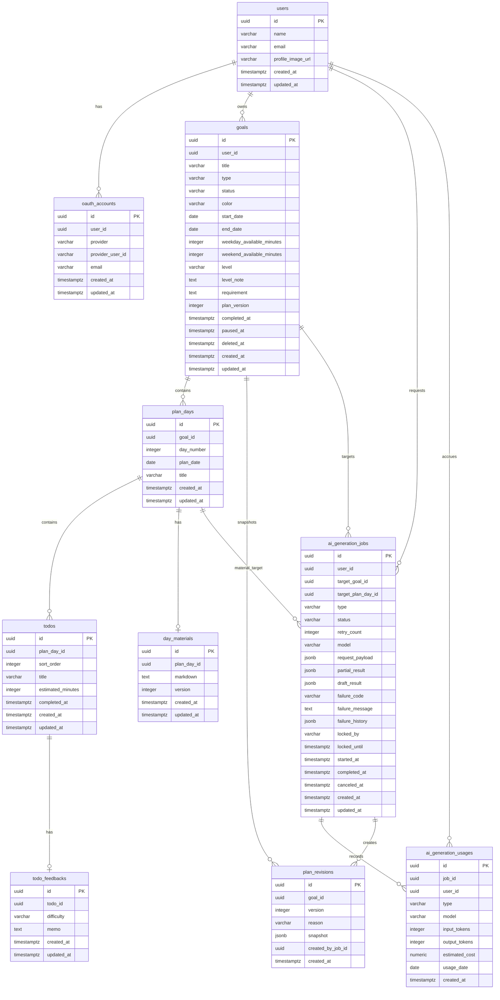

# Haenaeyo ER Diagram

이 문서는 1차 MVP 백엔드 구현을 위한 PostgreSQL 중심 ER Diagram이다.

Redis는 Spring Session, AI Job distributed lock, Redis Streams event delivery에 사용하지만 영구 도메인 저장소가 아니므로 ERD 테이블로 표현하지 않는다.

## Modeling Principles

- 주요 ID는 UUID이며 애플리케이션에서 생성한다.
- 물리 foreign key constraint는 기본적으로 만들지 않는다.
- ERD의 관계선은 logical relationship을 의미한다.
- 관계 컬럼은 `user_id`, `goal_id`, `plan_day_id`, `todo_id`, `job_id`처럼 명시적으로 둔다.
- 필수 관계 ID는 `not null`로 강제한다.
- 참조 무결성은 application validation, 명시적 삭제 순서, integration test로 보장한다.
- Unique constraint와 index는 DB에 둔다.
- 목표 삭제는 `goals.deleted_at`만 source of truth로 사용한다.
- 회원 탈퇴는 사용자 관련 데이터를 hard delete한다.

## Mermaid ER Diagram



## Table Notes

### `users`

서비스 사용자 프로필이다. OAuth provider별 계정은 `oauth_accounts`에 분리한다.

- `status` 컬럼은 두지 않는다. row가 있으면 active 사용자다.
- 회원 탈퇴 시 hard delete 대상이다.
- MVP timezone은 `Asia/Seoul` 고정이므로 사용자 timezone 컬럼은 두지 않는다.
- `email`은 unique가 아니다. 로그인 식별 기준은 OAuth provider identity다.
- `profile_image_url`은 nullable이다.
- `name`은 provider display name을 저장하며 MVP에서는 수정할 수 없다.

### `oauth_accounts`

Google/GitHub OAuth 계정 연결 정보다.

- `user_id`는 not null logical reference다.
- `(provider, provider_user_id)`는 unique다.
- `(user_id, provider)`는 unique다.
- `email`은 provider에서 받은 참고값이며 nullable이고 unique가 아니다.
- OAuth access/refresh token은 MVP에서 저장하지 않는다.

### `goals`

확정된 목표다. AI 계획 생성 중인 초안은 goal로 저장하지 않고 `ai_generation_jobs`의 `request_payload`, `partial_result`, `draft_result`에 저장한다.

- `user_id`는 not null logical reference다.
- 목표 생성 직후 상태는 `IN_PROGRESS`다.
- 상태 후보: `IN_PROGRESS`, `PAUSED`, `COMPLETED`.
- 유형 후보: `PROJECT`, `STUDY`, `FREE`.
- 수준 후보: `BEGINNER`, `INTERMEDIATE`, `ADVANCED`.
- 색상 후보: `INDIGO`, `MINT`, `CORAL`, `AMBER`, `SKY`, `PINK`.
- `COMPLETED`는 최종 상태다.
- `completed_at`은 유지한다.
- `paused_at`은 유지하며, 재개 시 null로 지운다.
- 목표 삭제는 `deleted_at` 기반 soft delete다.
- 하위 테이블에는 목표 삭제용 `deleted_at`을 두지 않는다.
- `plan_version`은 목표 생성 시 1이며 재계획 적용 시 증가한다.
- 기간 1~60일 제한은 domain/application validation으로 처리한다.
- `level_note`, `requirement`는 목표의 지속 조건으로 보존한다.

### `plan_days`

목표의 일차별 계획이다.

- `goal_id`는 not null logical reference다.
- `day_number`는 목표 시작일을 Day 1로 계산한다.
- `plan_date`는 KST 기준 local date다.
- `title`은 저장하며 비어 있을 수 없다.
- `estimated_minutes`는 저장하지 않는다. Day 예상 시간은 Todo 합계로 계산한다.
- Day 완료 상태는 별도 컬럼으로 저장하지 않고 Todo 완료 상태로 계산한다.

### `todos`

일차별 실행 Todo다.

- `plan_day_id`는 not null logical reference다.
- `sort_order`는 AI 생성 순서 보존을 위해 저장한다.
- Todo 완료 상태는 `completed_at`으로 표현한다.
- `completed_at is null`이면 미완료, 값이 있으면 완료다.
- 별도 status 컬럼은 두지 않는다.
- 수정 가능 필드는 `title`, `estimated_minutes`다.
- 수정 이력은 저장하지 않는다.
- 완료된 Todo는 수정할 수 없다.
- 완료 해제 시 `completed_at`을 null로 바꾸고 기존 feedback row를 삭제한다.
- 예상 시간 범위는 application validation으로 처리한다.

### `todo_feedbacks`

Todo 완료 후 선택적으로 남기는 난이도 피드백이다.

- `todo_id`는 not null logical reference다.
- Todo와 0:1 관계다.
- `todo_id`는 unique다.
- `difficulty` 후보: `EASY`, `NORMAL`, `HARD`.
- `memo`는 nullable이다.
- 피드백은 재계획과 이후 자료 생성 컨텍스트로 사용한다.

### `day_materials`

일차별 AI 생성 자료 Markdown이다.

- `plan_day_id`는 not null logical reference다.
- Plan day와 0:1 관계다.
- 계획 확정 시 미리 만들지 않고, Day 상세 최초 진입 후 AI 자료 생성 성공 시 row를 만든다.
- `plan_day_id`는 unique다.
- 현재 material 1개만 유지한다.
- `version`은 material history가 아니라 현재 row의 update version이다.
- 직접 수정 저장 또는 AI 재요청 preview 적용 시 `version += 1` 한다.
- 장기 material history table은 MVP에서 만들지 않는다.

### `plan_revisions`

재계획 적용 전 현재 계획 전체 snapshot을 저장한다.

- `goal_id`는 not null logical reference다.
- `created_by_job_id`는 nullable logical reference다.
- `snapshot`은 JSONB로 저장한다.
- MVP에서 revision UI는 노출하지 않는다.
- revision용 정규화 테이블은 만들지 않는다.

### `ai_generation_jobs`

AI 생성 작업의 영구 상태다.

- `user_id`는 not null logical reference다.
- `target_goal_id`, `target_plan_day_id`는 nullable이다.
- Job type별 target 필수 여부는 application/domain validation으로 검증한다.
- Job type 후보:
  - `PLAN`
  - `MATERIAL`
  - `MATERIAL_RETRY`
  - `REPLAN`
- Job status 후보:
  - `PENDING`
  - `RETRYING`
  - `RUNNING`
  - `COMPLETED`
  - `FAILED`
  - `CANCELED`
- 사용자당 active job은 1개만 허용한다.
- Active status는 `PENDING`, `RETRYING`, `RUNNING`이다.
- `model`은 Job 생성 시 선택된 대표/요청 모델이다.
- `request_payload`에는 구조화 입력값과 `prompt_template_version`만 저장한다. 최종 assembled prompt 문자열은 저장하지 않는다.
- `partial_result`는 AI 원본/진행 결과다.
- `draft_result`는 사용자가 수정한 확정 전 결과다.
- `result_payload`는 두지 않는다. 확정 후 source of truth는 도메인 테이블이다.
- `failure_code`, `failure_message`는 최신 실패 사유다.
- `failure_history`에는 retry별 sanitized failure를 누적한다.
- `locked_by`, `locked_until`은 Redis lock과 함께 worker 중복 실행 방어/관측용으로 사용한다.
- Redis Stream key는 저장하지 않고 `ai-job-events:{jobId}`로 계산한다.
- Redis Stream event를 Postgres에 별도 event table로 저장하지 않는다.

Target 규칙:

| Type | target_goal_id | target_plan_day_id |
| --- | --- | --- |
| `PLAN` | null | null |
| `REPLAN` | required | null |
| `MATERIAL` | required | required |
| `MATERIAL_RETRY` | required | required |

### `ai_generation_usages`

AI 사용량과 비용 추정을 기록한다.

- `job_id`는 not null logical reference다.
- `user_id`는 not null logical reference다.
- OpenAI 호출 1회당 1 row를 생성한다.
- Job 하나에 usage row가 여러 개 생길 수 있다.
- `model`은 실제 OpenAI 호출에서 사용한 모델이다.
- `usage_date`는 KST 기준 날짜다.
- retry도 usage에 포함한다.
- 회원 탈퇴 시 hard delete 대상이다.
- 목표 soft delete와 무관하게 유지한다.

## JSONB Shapes

### `plan_revisions.snapshot`

```json
{
  "goal": {
    "id": "uuid",
    "title": "string",
    "type": "PROJECT",
    "status": "IN_PROGRESS",
    "color": "INDIGO",
    "startDate": "2026-05-27",
    "endDate": "2026-06-25",
    "weekdayAvailableMinutes": 120,
    "weekendAvailableMinutes": 240,
    "level": "BEGINNER",
    "levelNote": "string",
    "requirement": "string",
    "planVersion": 1
  },
  "planDays": [
    {
      "id": "uuid",
      "dayNumber": 1,
      "planDate": "2026-05-27",
      "title": "string",
      "todos": [
        {
          "id": "uuid",
          "sortOrder": 1,
          "title": "string",
          "estimatedMinutes": 60,
          "completedAt": "2026-05-27T10:00:00Z",
          "feedback": {
            "difficulty": "NORMAL",
            "memo": "string"
          }
        }
      ],
      "material": {
        "id": "uuid",
        "markdown": "string",
        "version": 1
      }
    }
  ]
}
```

### `ai_generation_jobs.partial_result` / `draft_result`

`PLAN` / `REPLAN`:

```json
{
  "totalDays": 30,
  "generatedUntilDay": 12,
  "days": [
    {
      "dayNumber": 1,
      "date": "2026-05-27",
      "title": "프로젝트 구조 잡기",
      "todos": [
        {
          "sortOrder": 1,
          "title": "요구사항 정리",
          "estimatedMinutes": 60
        }
      ]
    }
  ]
}
```

`MATERIAL` / `MATERIAL_RETRY`:

```json
{
  "planDayId": "uuid",
  "markdown": "## 오늘의 개념...",
  "source": "AI",
  "basedOnMaterialVersion": 1
}
```

정책:

- JSONB shape는 Kotlin DTO로 관리한다.
- 계획 확정은 `draft_result.days` 기준으로 수행한다.
- material 적용은 `draft_result.markdown` 기준으로 수행한다.
- 테스트에서 JSONB shape serialization/deserialization을 검증한다.

## Core Constraints

초기 Flyway migration에 반영할 제약조건 후보:

```sql
-- oauth account uniqueness
unique (provider, provider_user_id)
unique (user_id, provider)

-- one material per plan day
unique (plan_day_id)

-- one feedback per todo
unique (todo_id)

-- day uniqueness per goal
unique (goal_id, day_number)
unique (goal_id, plan_date)

-- todo ordering per day
unique (plan_day_id, sort_order)

-- revision version uniqueness
unique (goal_id, version)
```

사용자당 active AI Job 1개 제한:

```sql
create unique index ux_ai_generation_jobs_user_active
    on ai_generation_jobs(user_id)
    where status in ('PENDING', 'RETRYING', 'RUNNING');
```

Enum-like check constraint 후보:

```sql
check (type in ('PROJECT', 'STUDY', 'FREE'))
check (level in ('BEGINNER', 'INTERMEDIATE', 'ADVANCED'))
check (color in ('INDIGO', 'MINT', 'CORAL', 'AMBER', 'SKY', 'PINK'))
check (status in ('IN_PROGRESS', 'PAUSED', 'COMPLETED'))
check (difficulty in ('EASY', 'NORMAL', 'HARD'))
check (type in ('PLAN', 'MATERIAL', 'MATERIAL_RETRY', 'REPLAN'))
check (status in ('PENDING', 'RETRYING', 'RUNNING', 'COMPLETED', 'FAILED', 'CANCELED'))
```

상태와 timestamp 조합, 목표 기간 1~60일, Todo 예상 시간 범위, Job type별 target 필수 여부는 DB check가 아니라 domain/application validation으로 처리한다.

## Query Indexes

오늘 화면:

```sql
create index ix_goals_user_status_active
    on goals(user_id, status)
    where deleted_at is null;

create index ix_plan_days_plan_date
    on plan_days(plan_date);

create index ix_todos_plan_day
    on todos(plan_day_id);
```

목표 목록:

```sql
create index ix_goals_user_status_created_active
    on goals(user_id, status, created_at desc)
    where deleted_at is null;
```

캘린더 월 조회:

```sql
create index ix_plan_days_goal_date
    on plan_days(goal_id, plan_date);
```

AI Job worker:

```sql
create index ix_ai_generation_jobs_status_created
    on ai_generation_jobs(status, created_at);

create index ix_ai_generation_jobs_locked_until
    on ai_generation_jobs(locked_until);
```

AI usage quota:

```sql
create index ix_ai_generation_usages_user_date_type
    on ai_generation_usages(user_id, usage_date, type);
```

## Delete Policy

### Goal Soft Delete

목표 삭제 시 `goals.deleted_at`만 설정한다.

조회 정책:

- 오늘 화면에서 제외.
- 목표 목록에서 제외.
- 캘린더에서 제외.
- 상세 URL 접근 시 `404 Not Found`.
- 목표 하위 plan day, todo, material 접근도 goal 삭제 여부를 확인해 `404 Not Found`.

하위 `plan_days`, `todos`, `day_materials`에는 MVP에서 `deleted_at`을 두지 않는다. Day/Todo/material 개별 삭제 기능이 생길 때 별도 migration으로 추가한다.

목표 soft delete와 무관하게 `ai_generation_jobs`, `ai_generation_usages`는 유지한다. 사용자 화면에는 삭제 목표 관련 Job을 노출하지 않는다.

### User Hard Delete

회원 탈퇴 시 사용자 관련 데이터는 hard delete한다. 물리 FK cascade에 의존하지 않고 application service에서 삭제 순서를 명시한다.

권장 삭제 순서:

1. `ai_generation_usages`
2. `ai_generation_jobs`
3. `plan_revisions`
4. `day_materials`
5. `todo_feedbacks`
6. `todos`
7. `plan_days`
8. `goals`
9. `oauth_accounts`
10. `users`

운영 로그에는 개인정보와 AI prompt/material 본문을 남기지 않는다.

## Milestone 1 Minimum

Milestone 1에서 반드시 필요한 테이블:

- `users`
- `ai_generation_jobs`
- `goals`
- `plan_days`
- `todos`

Milestone 1에서 있으면 좋은 테이블:

- `ai_generation_usages`
- `oauth_accounts`

Milestone 1 이후 바로 확장할 테이블:

- `todo_feedbacks`
- `day_materials`
- `plan_revisions`

## Closed Decisions

- MongoDB는 1차 MVP에서 사용하지 않는다.
- AI Job partial/draft는 PostgreSQL JSONB로 저장한다.
- AI prompt 원문 전체는 저장하지 않는다.
- `request_payload`에는 구조화 입력값과 `prompt_template_version`만 저장한다.
- `day_materials`는 현재 row 1개만 유지한다.
- `todo_feedbacks`는 `todos`와 0:1 별도 테이블이다.
- `plan_revisions.snapshot`은 JSONB로 저장한다.
- 목표 색상/유형/수준은 label이 아니라 key로 저장한다.
- 목표 제목/Todo 수정 이력은 저장하지 않는다.
- Redis Stream event는 Postgres에 별도 저장하지 않는다.
- 캘린더/오늘 화면용 summary table은 만들지 않는다.
